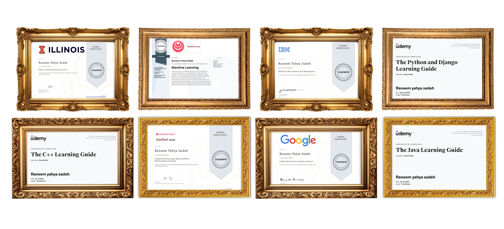

# Hey there! I'm Raneem Sa'deh

  

##  About Me

🎓 **AI & Data Science Engineering Student** at Al-Hussein Technical University (HTU)  
 **Based in:** Amman, Jordan  
 **GPA:** 3.8/4.0  
 **940+ hours** of hands-on ML development experience  

 **Currently working as:**
-  **AI/ML Engineer** (2022 - Present)
-  **Technical Lead @DSC** - Managing 150+ members
-  **Scientific Research Specialist @Scientific Research and Innovation Department, HTU** - Leading research initiatives

## 🏆 Recent Achievements

 **1st Place** - IFTP Global Innovation Challenge (Texas A&M University)  
 **3rd Place** - IEEE Pitching Competition with "Rafeeq" AI Transport Assistant  
 **1st Place** - MoDEE Entrepreneurship Hackathon 
 **Increased student engagement by 86%** through AI workshops  
 **Organized 5+ national AI competitions** with 500+ participants

## 🛠️ Tech Stack & Expertise

### 🤖 Machine Learning & AI

**Specializations:** Deep Learning • NLP • LLMs • Computer Vision • Reinforcement Learning • Time Series Forecasting

### 📊 Data Science & Analytics

**Skills:** Data Mining • Big Data Analytics • Statistical Inference • Data Visualization • Operations Research

### 💻 Programming Languages

### ☁️ Cloud & Tools

## Featured Projects

### 🔍 BiaEye — AI Waste Detection System
- **Tech:** YOLOv11, Computer Vision
- **Achievement:** 95% accuracy, Showcased at COP29
- **Impact:** Environmental sustainability through AI

### 🌌 NASA Geomagnetic Storm Forecasting
- **Tech:** RNN, TensorFlow, Time Series Analysis
- **Performance:** 2 seconds per data batch processing
- **Application:** Mission-critical space operations

### 🏥 ExcelCancer Care — AI Ultrasound Analysis
- **Tech:** Deep Learning, Medical Imaging
- **Research:** AI-based early detection
- **Recognition:** Presented at "AI in Health" regional event

### 🚀 Autonomous Robotic Arm
- **Tech:** Deep Q-Learning, TensorFlow, Reinforcement Learning
- **Simulation:** Lunar landing operations

## 📚 Research & Publications

📄 **"BiaEye: AI-Powered Waste Monitoring System"** - IEEE, 2024  
📄 **"ExcelCancer Care: AI for Early Diagnosis"** - AI in Healthcare, 2025

##  Certifications

##  GitHub Analytics

  
  

  

## 🌟 Leadership & Impact

 **Managing 150+ club members** as Technical Lead  
 **Organized 400+ participant competitions** nationwide  
 **80% increase in student engagement** through workshops  
 **Leading scientific research initiatives** at HTU

## 📈 Contribution Activity

## 🤝 Let's Connect!

##  Random AI Quote

---

  <h3> "Transforming ideas into intelligent solutions, one algorithm at a time" 🚀</h3>
  
<i>Always open to collaborating on AI/ML projects and research opportunities!</i>

---

  ⭐️ From [Raneem Sa'deh](https://github.com/raneemsadeh) | 940+ hours of ML magic ✨

